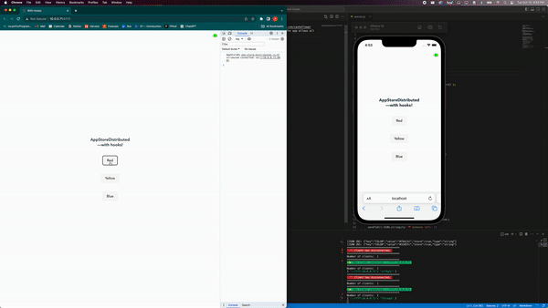

# app-store-distributed-hooks

This is a starter repo for using [Haxademic’s AppStoreDistributed](https://github.com/cacheflowe/haxademic.js/blob/master/src/app-store-distributed.es6.js) with React via hooks. The app allows all clients to connect over websockets and share state in real time.



## Installation

Clone the repo, navigate into it, and install the dependencies: 
```
git clone https://github.com/oliviaruizknott/app-store-distributed-hooks.git
cd app-store-distributed-hooks
npm install
```

### Set your environment variables:
Make a copy of `.env.sample` and name it `.env`. Replace the variables in `.env` with your own local IP address and desired port:

```
VITE_IP_ADDRESS=<your_ip_address>
VITE_WS_PORT=8082
```

If no variables are set, `VITE_IP_ADDRESS` will default to `localhost`, and the `VITE_WS_PORT` will default to `8082`. The app will work on the device where you run it, but you won’t be able to connect with other devices.

### Start the servers

First, start the websocket server. In the root of the project, run:
```
node index.js
```

In another terminal window, start the Vite server. In the root of the project, run:
```
npm run dev
```

Vite will output a link to open your project in browser, something like `http://localhost:5173`.

## Notes & Features
This project uses tools from [cacheflowe/haxademic.js](https://github.com/cacheflowe/haxademic.js):

- [SolidSocket](https://github.com/cacheflowe/haxademic.js/blob/master/src/solid-socket.es6.js) — establishes a connection to the websocket server; handles sending and recieving messages, reconnection, and cleanup; exposes listeners.

- [AppStore](https://github.com/cacheflowe/haxademic.js/blob/master/src/app-store-.es6.js) — a tool for app-wide state management, with optional localStorage integration.

- [AppStoreDistributed](https://github.com/cacheflowe/haxademic.js/blob/master/src/app-store-distributed.es6.js) — distributes the AppStore state across all clients connected over websockets, with optional client uuids.

The logic of [AppStoreDebug](https://github.com/cacheflowe/haxademic.js/blob/master/src/app-store-debug.es6.js) has been ported into the [AppStoreDebug React component](./src/components/debug/AppStoreDebug.jsx).

AppStore values are made accessible to React components with the [`useGetValue` hook](./src/hooks/useHaxademicStore.js).
